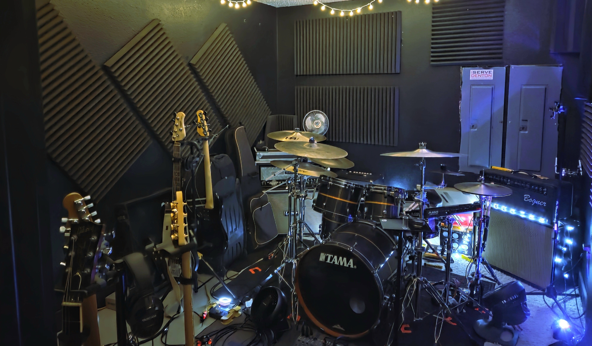

Top Secret Rehearsal Studios, LLC, (Top Secret Denton) is a music rehearsal studio in Denton, Texas, with 6000 square feet, consisting of a comfy lobby and 22 lock-out rehearsal spaces. Top Secret Denton is conveniently located just 3 blocks South of the Denton square. Top Secret Denton provides a safe and energizing place to focus on your art, while developing a community of like-minded and inspiring individuals.

---

## Instrument Repair
{: .box-note}
Eric has nearly 20 years of guitar tinkering, backed up with a Journeyman Certificate from the Galloup School of Guitar Building and Repair.  Not only that, but Eric is a Silver Level Taylor Factory Authorized Service Technician.  This means he has solid, hands-on chops for both acoustic and electric instruments.  Whether you're hitting the stage or or strumming in your living room, Eric will make sure your instrument plays smooth, sounds great, and feels ready for whatever you throw at it.

{: .box-note}
**Note:** If you would like to keep up with our progress or would be interested in our rehearsal spaces as they become available, please [contact us.](https://topsecretdenton.com/contact/)
